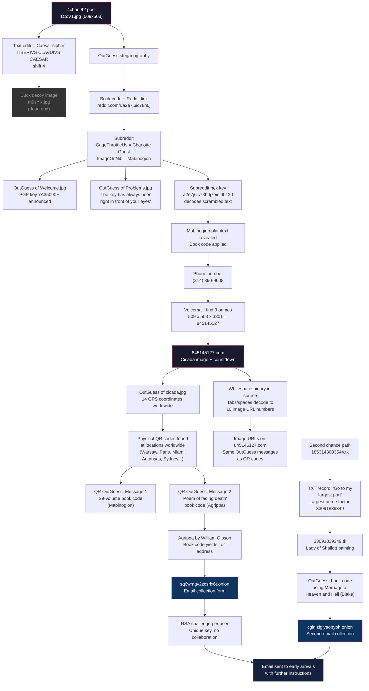

# 2012 Puzzle Flow

The 2012 puzzle was the first Cicada 3301 challenge. It began on January 4-5 with a 4chan image and progressed through steganography, book codes, a phone number, physical QR codes at 14 worldwide locations, and two parallel book code paths (Mabinogion and Agrippa) leading to Tor hidden services for email collection. A second-chance path was also provided for latecomers.

