# 2013 Puzzle Flow

The 2013 puzzle began on January 5 with a new 4chan image. It introduced the Gematria Primus (the runic alphabet central to all later puzzles), a bootable ISO image (CicadaOS), Twitter-based hex encoding, XOR operations with audio files, and a multi-stage Tor progression involving telnet interaction and ICMP ping data exfiltration. The final stages involved physical posters with phone numbers, Shamir's Secret Sharing, and a philosophical questionnaire.

```mermaid
graph TD
    A["4chan /b/ + /x/ post<br>232.jpg image"] --> B["OutGuess<br>Book of Law riddle +<br>book code (I:II:III chapters)"]

    B --> C["Liber AL vel Legis<br>(Aleister Crowley)<br>Book code yields URL"]

    C --> D["Dropbox link<br>130MB ISO file (CicadaOS)"]

    D --> E["Boot sequence<br>Prints primes up to 3301<br>Pauses at 1033 and 3301"]

    E --> F["@1231507051321<br>Twitter account revealed"]

    F --> G["Twitter hex tweets<br>65-byte hex at timed intervals<br>Reconstructed into binary file"]

    D --> H["AUDIO folder<br>761.mp3<br>'The Instar Emergence'<br>167 seconds (prime)"]

    G --> I["XOR Twitter data with 761.mp3"]
    H --> I

    I --> J["Gematria Primus image<br>Rune-to-letter-to-prime<br>mapping table (29 runes)"]

    J --> K["OutGuess of Gematria Primus<br>Whitespace binary<br>(tabs + spaces)"]

    K --> L["emiwp4muu2ktwknf.onion<br>ASCII art cicada"]

    L --> M["Telnet interactive shell<br>Commands: hello, hint,<br>count, number, primes"]

    M --> N["'hello' command<br>Hex message decodes to<br>xsxnaksict6egxkq.onion"]

    M --> O["'hint' command<br>XOR with _560.00 from<br>CicadaOS DATA folder"]
    O --> O2["'You can't see the forest<br>when you're looking<br>at the trees'"]

    N --> P["xsxnaksict6egxkq.onion<br>'Patience is a virtue'"]

    P --> Q["Page update:<br>'knock on the sky and<br>listen to the sound'"]

    Q --> R["ICMP ping to clearnet IP<br>li498-122.members.linode.com<br>Double echo replies with<br>embedded hex data"]

    R --> S["Hex = gzipped message.txt.asc<br>pklmx2eeh6fjt7zf.onion"]

    S --> T["Physical posters at<br>7 worldwide locations<br>with phone numbers +<br>access codes"]

    T --> U["Phone call: dataset + offset<br>XOR with CicadaOS _560.XX<br>yields unique .onion per location"]

    U --> V["Each .onion gives<br>SSSS code<br>(Shamir's Secret Sharing)"]

    V --> W["5-of-7 SSSS threshold<br>yields p7amjopgric7dfdi.onion"]

    W --> X["19 philosophical questions<br>+ email submission"]

    X --> Y["Email: build TCP server<br>as Tor hidden service<br>Deadline: Feb 3, 2013 UTC"]

    style A fill:#1a1a2e,stroke:#e94560,color:#fff
    style J fill:#1a1a2e,stroke:#0f3460,color:#fff
    style L fill:#0f3460,stroke:#e94560,color:#fff
    style S fill:#0f3460,stroke:#e94560,color:#fff
    style W fill:#0f3460,stroke:#e94560,color:#fff
    style Y fill:#16213e,stroke:#0f3460,color:#fff
```

