# 2014 Puzzle Flow

The 2014 puzzle is the most complex, spanning January through May. It introduced RSA encryption, multiple Tor onion services with slowly-growing hex strings, Liber Primus pages as embedded JPEGs, columnar transposition ciphers, magic squares summing to 1033/3301, OpenPuff steganography, and a GEB (Godel Escher Bach) book code. The final onion delivered LP2 -- the 58-page runic manuscript that remains unsolved.

```mermaid
graph TD
    A["Tweet from @1231507051321<br>Links to i.imgur.com/zN4h51m.jpg"] --> B["OutGuess<br>Self-Reliance riddle +<br>book code (para:sent:word:letter)"]

    B --> C["Self-Reliance<br>by Ralph Waldo Emerson<br>Yields onion address"]

    C --> D["Onion 1: auqgnxjtvdbll3pv.onion<br>1033.jpg image<br>OutGuess: RSA public key +<br>encrypted message"]

    D --> E["RSA decrypt<br>(e=65537, low-bit modulus)<br>Yields next address"]

    E --> F["Onion 2: cu343l33nqaekrnw.onion<br>Slowly growing hex string<br>(~23 hours, 2 chars at a time)"]

    F --> G["Final hex = 3 embedded JPGs<br>XOR 0xFF to extract<br>onion1.jpg, onion2.jpg,<br>onion3.jpg (reversed)"]

    G --> H["OutGuess each JPG<br>XOR all 3 binaries together"]

    H --> I["Columnar transposition<br>14 columns reordered<br>'ULTIMATE TRUTH IS THE<br>ULTIMATE ILLUSION'"]

    I --> J["Onion 3: fv7lyucmeozzd5j4.onion<br>Growing hex string +<br>Apache server-status leak"]

    J --> K["server-status: LP page 05.jpg<br>embedded as hex + reversed copy"]
    J --> L["OOB data between JPGs<br>= magic square (sum 1033)"]
    J --> K2["Second status update:<br>LP pages 03.jpg + 04.jpg"]

    K2 --> K3["OutGuess of 03.jpg<br>Vigenere cipher<br>key: 'welcome pilgrim to the'<br>Yields next onion"]

    K3 --> M["Onion 4: avowyfgl5lkzfj3n.onion<br>512-char hex string<br>Goes offline, returns Jan 29"]

    M --> N["Signed gzip file<br>Contains 4 LP images<br>(06.jpg - 09.jpg)"]

    N --> O["OutGuess of 08.jpg<br>Columnar transposition<br>period=7, key=1736254"]

    O --> P["Onion 5: q4utgdi2n4m4uim5.onion<br>Two phases"]

    P --> Q["Phase 1: hex string<br>= Interconnectedness.mp3<br>by 3301"]
    P --> R["Phase 2: portrait image<br>(Goya: Andres del Peral)<br>Hidden Rasputin + numbers<br>summing to 1033 and 3301"]

    Q --> S["OpenPuff steganography<br>password: 33011033<br>Extracts 3 magic squares<br>(sums: 3301, 1033, 1033)"]

    R --> T["OutGuess/bzip of portrait<br>= 3 files: 2 JPGs + 1 MP3<br>Godel + Escher + Bach"]

    T --> U["GEB book code<br>(chapter:line:word:letter)<br>using Hofstadter's GEB"]

    U --> V["Onion 6: ut3qtzbrvs7dtvzp.onion<br>Hex = 4 LP images<br>(10.jpg - 13.jpg)"]

    V --> W["Magic square submission form<br>Paste 3 squares + provide<br>your Tor hidden service URL"]

    W --> X["Accepted submission returns<br>3 more LP images<br>(107.jpg, 167.jpg, 229.jpg)"]

    S --> W

    Y["2014.05.02 ~10:00 GMT<br>3301 contacts hidden services<br>GET /key.asc, POST message.txt.asc<br>User-Agent: CicaDOS 1.033"]

    Y --> Z["Onion 7: ky2khlqdf7qdznac.onion<br>thttpd server"]

    Z --> LP["LP2: 58 pages (0.jpg - 57.jpg)<br>The Liber Primus<br>UNSOLVED"]

    style A fill:#1a1a2e,stroke:#e94560,color:#fff
    style D fill:#0f3460,stroke:#e94560,color:#fff
    style F fill:#0f3460,stroke:#e94560,color:#fff
    style J fill:#0f3460,stroke:#e94560,color:#fff
    style M fill:#0f3460,stroke:#e94560,color:#fff
    style P fill:#0f3460,stroke:#e94560,color:#fff
    style V fill:#0f3460,stroke:#e94560,color:#fff
    style Z fill:#0f3460,stroke:#e94560,color:#fff
    style LP fill:#8b0000,stroke:#ff0000,color:#fff
```

